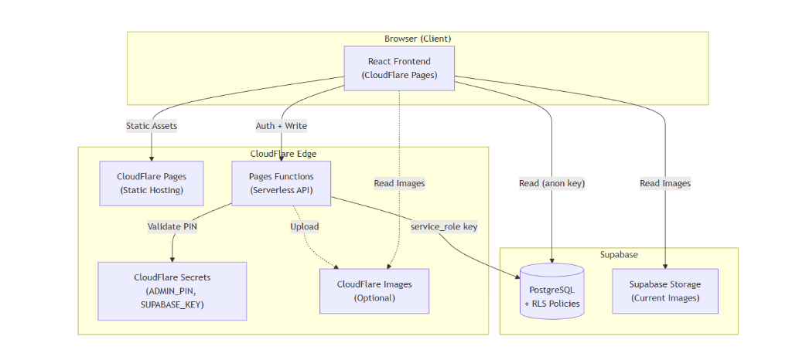

# SagerTilSalg

A mobile-first warehouse showroom website for Peter Behrend. Features inventory browsing, search, favorites, and an admin panel for inventory management.

## 🚀 Quick Start

```bash
npm install
npm run dev
```

## 🏗️ Architecture



- **Frontend**: React + Vite, hosted on CloudFlare Pages.
- **Backend**: CloudFlare Pages Functions for secure admin operations.
- **Database**: Supabase (PostgreSQL) with Row Level Security.
- **Storage**: Supabase Storage for item images.

## 📦 Tech Stack

- **React 19** with Vite
- **Tailwind CSS** for styling
- **Lucide React** for icons
- **Supabase** for database and storage
- **CloudFlare Pages** for hosting (migrating from GitHub Pages)

## 🔐 Security

- Admin PIN verification via server-side CloudFlare Function
- Supabase RLS policies for "Public Read / Admin Write"
- Service role keys stored as CloudFlare Secrets

## 📁 Project Structure

```
src/
├── components/      # React components
├── utils/           # Storage, Supabase client, helpers
└── App.jsx          # Main application controller

functions/           # CloudFlare Pages Functions (Phase 2)
├── verify-pin.js    # Admin authentication
└── admin/           # Secure write operations

docs/
└── architecture.png # System architecture diagram
```

## 📄 License

Private project for Peter Behrend.
